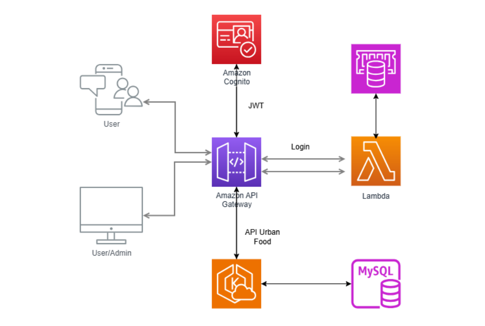
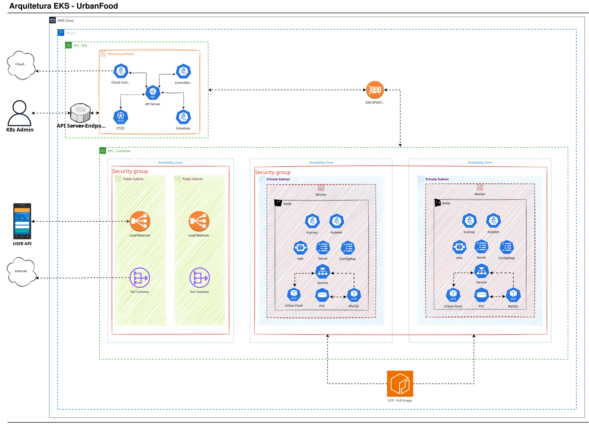
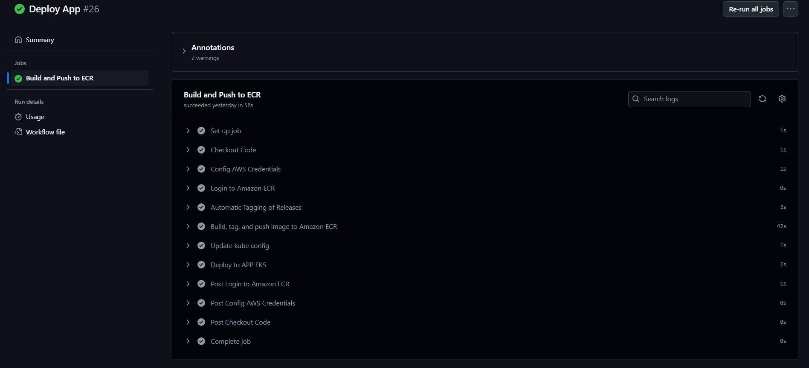
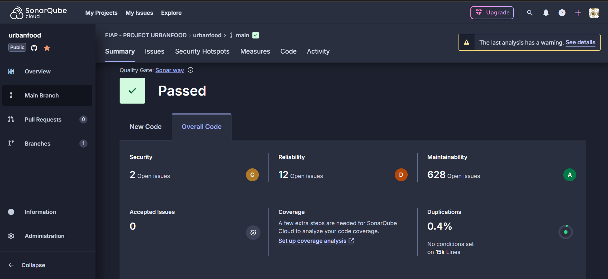
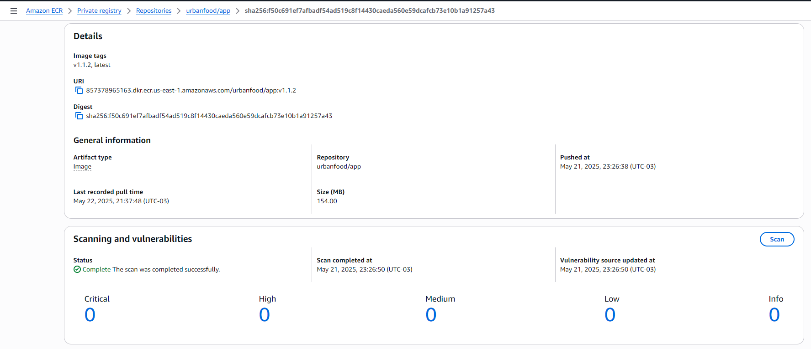
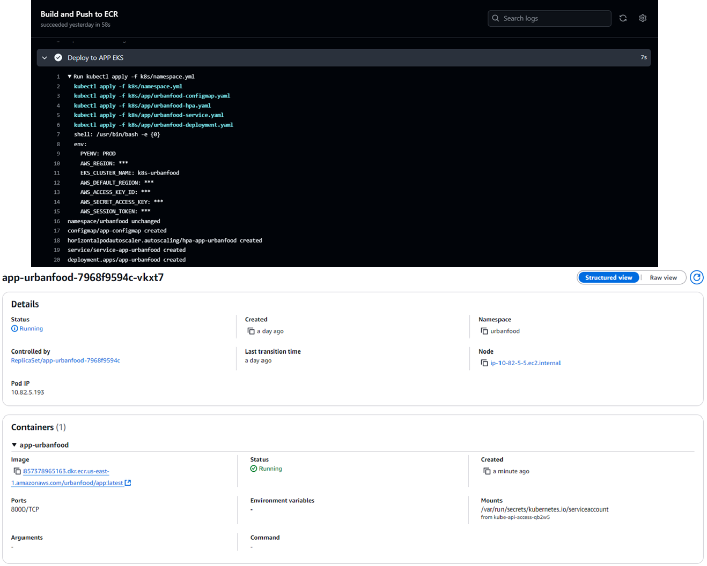

<div align='Center'>
    <h1><b>🗒Urban-Food - Documentação do Projeto.</b></h1>
<br />
<br />
</div>

# 💻 Projeto Urban-Food
## O que é o projeto?
O projeto visa desenvolver um sistema de controle de pedidos para uma lanchonete que está em processo de expansão. 
O objetivo principal é otimizar o atendimento, minimizar erros e melhorar a eficiência da operação, garantindo uma experiência mais satisfatória tanto para os clientes quanto para os funcionários.

## Requisitos do Negócio:

Os principais objetivos do projeto são:

 - Implementar um sistema digital de controle de pedidos para substituir o método manual e reduzir erros no atendimento.
 - Aumentar a eficiência do processo de pedidos ao garantir que todas as solicitações sejam registradas de forma clara e precisa.
 - Melhorar a comunicação entre atendentes e cozinha, especialmente em pedidos complexos, como hambúrgueres personalizados.
 - Oferecer uma experiência mais ágil e organizada aos clientes, minimizando confusões e tempos de espera.
 - Apoiar a expansão da lanchonete com um sistema escalável que acompanhe o crescimento do negócio.


## Documentação da Infraestrutura.

O serviço foi implantando na AWS utilizando o serviço do Elastic Kubernets Service (EKS). 

Porque o EKS da AWS?
 - Como o projeto foi arquitetado a partir de contêiner, foi escolhido o Kubernetes devido a oferecer um conjunto de benefícios, que é a orquestração avançada que simplifica a implantação e o gerenciamento de aplicativos contêinerizados. O Kubernetes automatiza tarefas complexas, como balanceamento de carga, escalonamento automático, recuperação de falhas e atualizações contínuas, permitindo que a equipe se concentre no desenvolvimento do aplicativo sem a distração das complexidades de infraestrutura subjacentes.

Utilizamos alguns recursos do K8S, conforme imagem: DAP-URBAN_FOOD.svg





 - API Server Endpoint: Quando você cria um cluster, o Amazon EKS cria um endpoint para o servidor gerenciado de API do Kubernetes usado para se comunicar com o cluster (usando as ferramentas de gerenciamento do Kubernetes, como kubectl). Por padrão, esse endpoint do servidor de API é público para a Internet, e o acesso ao servidor de API é protegido usando uma combinação de AWS Identity and Access Management (IAM) e Kubernetes Role Based Access Control (RBAC) nativo. Esse endpoint é conhecido como o endpoint de cluster público. Também há um endpoint de cluster privado.

 - Gerenciar recursos de nuvem (Cloud Controller Manager)- As interações entre Kubernetes e o provedor de nuvem que realiza solicitações para os recursos subjacentes do data center são tratadas pelo Cloud Controller Manager(cloud-controller-manager). Os controladores gerenciados pelo Cloud Controller Manager podem incluir um controlador de rota (para configurar rotas de rede na nuvem), controlador de serviço (para usar serviços de balanceamento de carga na nuvem) e controlador de ciclo de vida de nós (para manter os nós sincronizados com o Kubernetes durante os ciclos de vida).

 - HPA - Escalonamento Automático: Foi configurado para ajustar dinamicamente o número de contêineres em execução com base na carga, garantindo a utilização ideal dos recursos.   
    - Se a lanchonete tiver uma alta demanda de usuários o serviço e escalado e consegue dar conta da demanda, de forma transparente ao usuário, quando a demanda baixar, ele retorna ao valor default, tornando o serviço estável, eficiente e confiável.

 - Deployment - Gestão de recursos: A configuração correta do Deployment permite o gerenciamento preciso de recursos, permitindo que você defina limites de recursos e solicitações para pods, garantindo o uso eficiente da CPU e da memória.
 
 - Deployment - Monitoramento: Os recursos de livenessProbe e readinessProbe ajudam a manter o serviço ativo, se um contêiner ou pod falhar, ele será substituído automaticamente, mantendo seu aplicativo funcionando e garantindo entrega de serviço consistente.

 - PVC - Armazenamento: Uma PersistentVolumeClaim (PVC) é uma requisição para armazenamento por um usuário, ou seja, uma forma de configurar um volume Persistente de dados.
    - Configuramos um PVC para persistir os dados do MySQL POD/Contêiner, assim em um restart ou implantação de um novo recurso os dados inseridos não são perdidos.

 - PV - Armazenamento: Pods utilizam recursos do nó e PVCs utilizam recursos do PV.
    - Criado para que seja possível utilizar o PVC, o PV e criado no nível  do cluster.

 - ConfigMaps - Arquivo de Configuração: Utilizamos o ConfigMap para definir o arquivo de configuração não sensíveis separadamente do código e das imagens do Contêiner. 
    - Utilizamos o configmap para definir a configuração da API de backend, como o banco de dados.

 - Secrets - Criptografia Dados: Os Secrets são usados ​​para armazenar e gerenciar dados confidenciais, como senhas, tokens e chaves SSH, de forma segura. Configurado para fornecer melhores práticas de segurança em vez de deixar o dado exposto no ConfigMaps.
    - O secret foi utilizado no projeto para codificar a senha do MySQL em base64. O objetivo e evitar a exposição da informação no namespace do serviço.

 - Service - Network: No Kubernetes, um serviço é um método para expor um aplicativo de rede que está sendo executado e fornecem descoberta e roteamento entre pods.
    - Estamos utilizando para conectar o serviço ao MySQL, mesmo cada serviço rodando em nodes diferentes em um cluster, além de expor o serviço para o usuário final.

 - ELB - Balanceador de Carga: O Elastic Load Balancing (ELB) distribui automaticamente o tráfego de aplicações de entrada entre vários destinos e dispositivos virtuais em uma ou mais zonas de disponibilidade (AZs).
    - O ELB balanceia o tráfego das requests dos usuários entre os nodes/service da nossa aplicação, já que estamos rodando a aplicação em Multi-AZ.

 - NatGateway: Um gateway NAT possibilita que um contêiner em uma sub-rede privada possa se conectar a serviços fora da VPC/rede, mas os serviços externos não podem iniciar uma conexão com essas instâncias.
    - Utilizado para que o contêiner consiga fazer uma requisição ao serviço externo "hospedado na internet", no caso, temos a dependência do mercadopago, necessário para efetuar o pagamento dos pedidos.

 - ECR - Repositório: O Amazon Elastic Container Registry (Amazon ECR) é um registro de contêiner totalmente gerenciado que oferece hospedagem de alta performance para que você possa implantar imagens e artefatos de aplicações de forma confiável em qualquer lugar.
    - O ECR e o nosso repositório de imagens de contêiner, nele podemos fazer o push do nosso ambiente para a AWS, e após efetuar a implantação manualmente, via CI/CD entre outras opções que a AWS disponibiliza.

## EKS - Acesso a API..
http://a893e01106ac84940b66ecf6b0ce9975-595107545.us-east-1.elb.amazonaws.com:8000/swagger/

## Documentação Api's - Collection do Postman (JSON). 
https://documenter.getpostman.com/view/9974185/2sAXxV5q49#50505fb2-61ea-4f43-b59d-13758a674a65

<br />

# ###########################################################
# 💻 Deploy via Github Actions

### Executando o CI/CD

Etapas do Pipeline via github actions:

1.1 Build da Applicação:


1.2 Sonar para análise e monitoramento contínuo da qualidade do código.


1.3 Push da Imagem para o ECR.


1.4 Deploy no EKS.


# ###########################################################
# 💻 Deploy via Docker-Compose

### Iniciar o projeto via docker-compose na maquina local

1.1 Executando o build via Docker Compose na raiz do projeto..
``` bash
docker compose up -d --build
```

1.2 Acesso a API..
```
http://localhost:8000/swagger/
```

1.3 Acesso pelo WebServer..
```
http://localhost/swagger/
```

# ###########################################################
# 💻 Enviando a Imagem para o ECR

## Processo Automatizado via Github Actions

1.1 Exemplo de como criar as Variáveis de Ambiente..
``` bash
export MySQL_VERSION='8.4'
export API_IMAGE_TAG='1.0.0'
export AWS_REGION='us-east-1'
export AWS_ACCOUNT='857378965163'
```

1.2 Docker Tag App..
``` bash
docker tag urbanfood:$API_IMAGE_TAG $AWS_ACCOUNT.dkr.ecr.$AWS_REGION.amazonaws.com/fiap/urbanfood:$API_IMAGE_TAG
docker tag $AWS_ACCOUNT.dkr.ecr.$AWS_REGION.amazonaws.com/fiap/urbanfood:$API_IMAGE_TAG $AWS_ACCOUNT.dkr.ecr.$AWS_REGION.amazonaws.com/fiap/urbanfood:latest
```

1.3 Docker Tag MySQL..
``` bash
docker tag mysql:$MySQL_VERSION $AWS_ACCOUNT.dkr.ecr.$AWS_REGION.amazonaws.com/fiap/mysql:$MySQL_VERSION
docker tag $AWS_ACCOUNT.dkr.ecr.$AWS_REGION.amazonaws.com/fiap/mysql:$MySQL_VERSION $AWS_ACCOUNT.dkr.ecr.$AWS_REGION.amazonaws.com/fiap/mysql:latest
```

1.4 Docker Login ECR..
``` bash
aws ecr get-login-password --region $AWS_REGION | docker login --username AWS --password-stdin $AWS_ACCOUNT.dkr.ecr.$AWS_REGION.amazonaws.com
```

1.5 Docker Push do APP..
``` bash
docker push $AWS_ACCOUNT.dkr.ecr.$AWS_REGION.amazonaws.com/fiap/urbanfood:$API_IMAGE_TAG
docker push $AWS_ACCOUNT.dkr.ecr.$AWS_REGION.amazonaws.com/fiap/urbanfood:latest
```

1.6 Docker Push do MySQL..
``` bash
docker push $AWS_ACCOUNT.dkr.ecr.$AWS_REGION.amazonaws.com/fiap/mysql:$MySQL_VERSION
docker push $AWS_ACCOUNT.dkr.ecr.$AWS_REGION.amazonaws.com/fiap/mysql:latest
```

# ###########################################################
# 💻 Deploy no EKS

## Processo Automatizado via Github Actions

## Configuração do kubectl

2.1 Configurar o acesso ao cluster
``` bash
aws eks update-kubeconfig --region us-east-1 --name k8s-urbanfood --profile terraform-iac
```

2.2 Entramos no diretório do projeto para configurar o ambiente.
``` bash
cd urbanfood/k8s
kubectl apply -f aws-auth.yml
kubectl apply -f namespace.yml
```

2.3 Acessando o namespace, "Após já ter sido criado"
``` bash
kubectl config set-context --current --namespace=urbanfood
```

Após criar e configurar a infra executamos o github actions do projeto. 

Para documentar: 

2.4 Para subir a aplicação de forma manual:
``` bash
kubectl apply -f app/urbanfood-configmap.yaml
kubectl apply -f app/urbanfood-service.yaml
kubectl apply -f app/urbanfood-hpa.yaml
kubectl apply -f app/urbanfood-deployment.yaml
```

2.5Para subir o nginx de forma manual:
``` bash
kubectl apply -f nginx/nginx-configmap.yaml
kubectl apply -f nginx/nginx-service.yaml
kubectl apply -f nginx/nginx-hpa.yaml
kubectl apply -f nginx/nginx-deployment.yaml
```

# ###########################################################
# 💻 Deploy via DockerFile

### 1. Preparar o ambiente para gerar o pacote

1.1 Exemplo de como criar as Variáveis de Ambiente..
``` bash
export PYENV="DEV"
export API_IMAGE_TAG='1.0'
```

1.2 Docker Build na raiz do projeto..
Parametros opcionais no build: --build-arg PYENV="PROD" --build-arg APP_FOLDER=app/
``` bash
docker build --no-cache --progress=plain -f devops/Dockerfile-App --build-arg PYENV="PROD" --build-arg APP_FOLDER=app/ -t app-urban-food:$API_IMAGE_TAG .
```

1.3 Docker UP..
```
docker run -dit -p 8000:8000 --name=app-urban-food app-urban-food:$API_IMAGE_TAG
```

### Link do Swagger da API
```
http://localhost:8000/swagger/
```

# 💻 Deploy da aplicação local - Sem Docker

### Python Install

1.1 Instalação do Python..
``` bash
sudo apt-get install python3.12 python3.12-dev python3.12-venv pkg-config default-libmysqlclient-dev build-essential
```

1.2 Validando a versão do Python instalada..
``` bash
python3.12 --version
Python 3.12.6
```

1.3 Criando virtualenv, na raiz do projeto..
``` bash
python3.12 -m venv .venv
source .venv/bin/activate
```

1.4 Instalar dependencias..
``` bash
pip install --upgrade pip
python -m pip install -r app/requirements.txt
```

1.5 Configuração das variaveis de ambiente necessarias para rodar a aplicação..
``` bash
cd app/
vim .env
```

1.6 Limpa o Cache, se existir..
``` bash
find . | grep -E "(/__pycache__$|\.pyc$|\.pyo$)" | xargs rm -rf
```

1.7 Limpa Migracoes..
``` bash
find . -name '00*.py' -delete
```

1.8 Iniciando os migrations..
``` bash
python manage.py makemigrations
python manage.py migrate
```

1.9 Start da Aplicação..
``` bash
python manage.py runserver localhost:8000
```

2.0 Gerar o freeze dos pacotes, dentro do diretorio app..
``` bash
python -m pip freeze > requirements.txt
```

### Link do Swagger da API - Local
```
http://localhost:8000/swagger/
```
<br />
